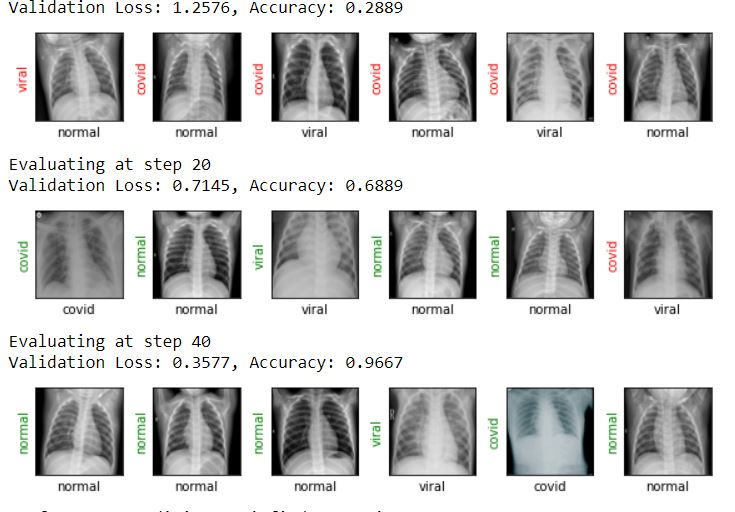
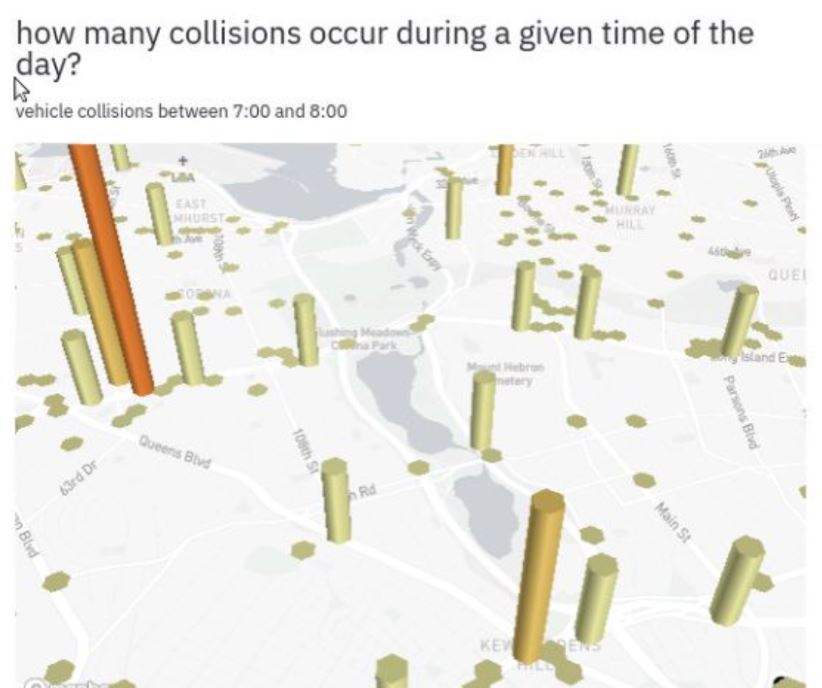

---
# Portfolio
#### Data Driven Insights and Solutions | ML | DL | Python | SQL

---

## Project # 1: Analysis of Stock Markets Using News Headlines

News articles are automatically being generated from figures and earnings call streams?
In this project, we will generate investing insight by applying sentiment analysis on financial news headlines 
from FINVIZ.com. Using this natural language processing technique, we can understand the emotion behind the headlines
and predict whether the market feels good or bad about a stock. It would then be possible to make educated guesses on 
how certain stocks will perform and trade according.
The details of our analysis can be found here: [Source Code](https://github.com/t-arf/NLP-Projects/blob/main/Sentiment%20Analysis%20of%20Stock%20Markets%20Using%20News%20Headlines/notebook.ipynb)

---
## Project # 2: Detecting COVID-19 with Chest X-Ray using PyTorch

## DESCRIPTION

In this project, we will use PyTorch to create and train a ResNet-18 model and apply it to a Chest X-Ray Radiography Dataset.
## Dataset: Dataset is from COVID-19 Radiography Dataset on [Kaggle](https://www.kaggle.com/tawsifurrahman/covid19-radiography-database)

We have accomplished it in by completing each task in the project:
### TASKS: 
#### 1. Importing Libraries
#### 2. Creating Custom Dataset
#### 3. Image Transformations
#### 4. Prepare DataLoader
#### 5. Data Visualization
#### 6. Creating the Model
#### 7. Training the Model
#### 8. Final Results: We are able to get about 96.67% accuracy,

The source code can be found in this [Notebook]https://github.com/t-arf/COVID-19-Data-Exploration-Visualization-and-Modelling/blob/master/Detecting%20COVID-19%20with%20Chest%20X-Ray%20using%20PyTorch/COVID-Detection-PyTorch.ipynb)

## Project # 5:

### INTRODUCTION:

### DATA:

### TOOLS & TECHNOLOGIES:

### RESULTS:

### INSIGHTS & FINDINGS:
From the current analysis, we can draw several insights such as:

  5. The reduction in productivity is due to non-familiarity with distance learning and work from home.

### CONCLUSION:
[Notebook]htts://github.com/t-arf/COVID-19-Data-Exploration-Visualization-and-Modelling/blob/master/Detecting%20COVID-19%20with%20Chest%20X-Ray%20using%20PyTorch/COVID-Detection-PyTorch.ipynb)

---

### PROJECT # 6: An Interactive End-to-End Data Driven Web Application in Python (Streamlit)

I worked on data-driven web applications. These applications provide an interactive view of data in the form of a dashboard. I found Streamlit (Python Framework) very useful in this regard, so I built and deployed an interactive web application using Python and Streamlit. The application is able to:

    1. Show the dataset on the user's choice.
    2. Show the products corresponding to the selected sellers.
    3. Show per year MRP, discount%, and sale price.

You can find the complete [source code] and demo [here]() 
