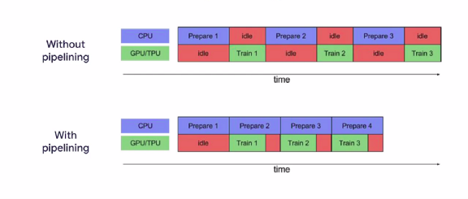

Portfolio
---
# 
#### Data Driven Insights and Solutions | ML | DL | Python | SQL

---

## Project # 1: Analysis of Stock Markets Using News Headlines

In this project, I generated investing insight by applying sentiment analysis on financial news headlines 
from FINVIZ.com. Using this natural language processing technique, we can understand the emotion behind the headlines
and predict whether the market feels good or bad about a stock. It would then be possible to make educated guesses on 
how certain stocks will perform and trade according.
The details of our analysis can be found here: [Source Code](https://github.com/t-arf/NLP-Projects/blob/main/Sentiment%20Analysis%20of%20Stock%20Markets%20Using%20News%20Headlines/notebook.ipynb)

---
## Project # 2: Detecting COVID-19 with Chest X-Ray using PyTorch

### Introduction:
In this project, we will use PyTorch to create and train a ResNet-18 model and apply it to a Chest X-Ray Radiography Dataset.
### Dataset: Dataset is from COVID-19 Radiography Dataset on [Kaggle](https://www.kaggle.com/tawsifurrahman/covid19-radiography-database)

I have accomplished it in by completing the following tasks in the project:
#### 1. Importing Librarie and Creating Custom Dataset
#### 2. Image Transformations
#### 3. Prepare DataLoader
#### 4. Data Visualization
#### 5. Creating the Model
#### 5. Training the Model
#### Final Results: We are able to get about 96.67% accuracy,

##### The source code can be found in this [Notebook](https://github.com/t-arf/COVID-19-Data-Exploration-Visualization-and-Modelling/blob/master/Detecting%20COVID-19%20with%20Chest%20X-Ray%20using%20PyTorch/COVID-Detection-PyTorch.ipynb)

## Project # 3: Data pipelining for effective use of CPU and GPU with Tensorflow and TFDS

### Introduction:
 In this project, I have parallelized the  various stages of Extract, Transform and Load processes in Tensorflow using the following steps:
1. Parallelize the extraction of the stored TFRecords of the cats_vs_dogs dataset by using the interleave operation.
2. Parallelize the transformation during the preprocessing of the raw dataset by using the map operation.
3. Cache the processed dataset in memory by using the cache operation for faster retrieval.
4. Parallelize the loading of the cached dataset during the training cycle by using the prefetch operation.

### Results:
Due to the parallelization of the various stages of the ETL processes, you should see a decrease in training time as compared to the naive approach depicted at beginning of the notebook.

The code can be found [here](https://github.com/t-arf/TensorFlow-Data-and-Deployment/blob/main/Data-Pipelines-with-TensorFlow-Data-Services/utf-8''TFDS-V2-Week4.ipynb)
---

## Project # 4:Exploring the Evolution of Linux

### Introduction:

Version control repositories like CVS, Subversion or Git can be a real gold mine for software developers.
They contain every change to the source code including the date (the "when"), the responsible developer (the "who"),
as well as little message that describes the intention (the "what") of a change.

In this notebook, I will analyze the evolution of a very famous open-source project – the Linux kernel. 
The Linux kernel is the heart of some Linux distributions like Debian, Ubuntu or CentOS.
#### The code can be found [here](https://github.com/t-arf/Portfolio/blob/main/Exploring-the-evolution-of-Linux/notebook.ipynb)
---

### PROJECT # 5: An Interactive End-to-End Data Driven Web Application in Python (Streamlit)

I worked on data-driven web applications. These applications provide an interactive view of data in the form of a dashboard. I found Streamlit (Python Framework) very useful in this regard, so I built and deployed an interactive web application using Python and Streamlit. 

You can find the complete [source code](https://github.com/t-arf/Building-a-DS-Web-Application-with-Streamlit-and-Python)
and demo [here](https://drive.google.com/file/d/1OlyTYVitShbGwnv1lcuALe_JavtKll-U/view?usp=sharing) 
